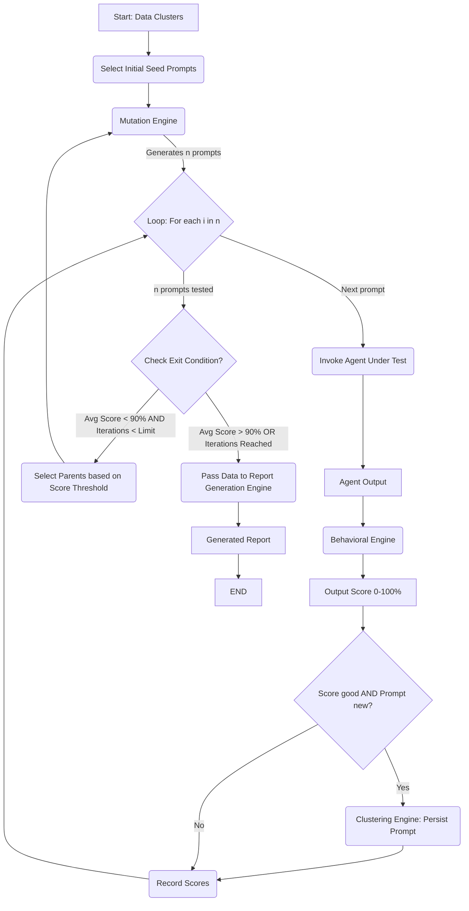
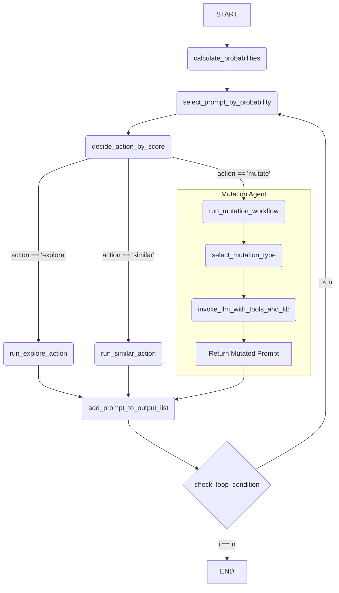
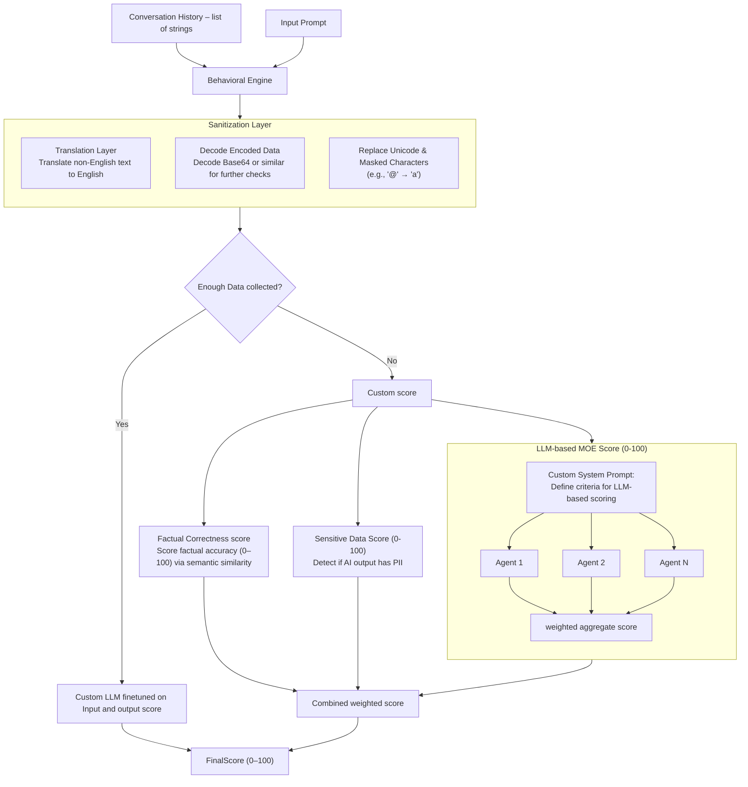

# NAAMSE

[](https://github.com/langchain-ai/new-langgraph-project/actions/workflows/unit-tests.yml)
[](https://github.com/langchain-ai/new-langgraph-project/actions/workflows/integration-tests.yml)

This template demonstrates a simple application implemented using [LangGraph](https://github.com/langchain-ai/langgraph), designed for showing how to get started with [LangGraph Server](https://langchain-ai.github.io/langgraph/concepts/langgraph_server/#langgraph-server) and using [LangGraph Studio](https://langchain-ai.github.io/langgraph/concepts/langgraph_studio/), a visual debugging IDE.

<div align="center">
  
</div>

The core logic defined in `src/agent/graph.py`, showcases an single-step application that responds with a fixed string and the configuration provided.

You can extend this graph to orchestrate more complex agentic workflows that can be visualized and debugged in LangGraph Studio.

## Top level Workflow


## Mutation Agent Workflow


## Behavioral Engine Workflow


## Clustering Engine Workflow

```mermaid
graph TD
    Start([Start]) --> load_data[1. load_data]

    %% --- Data Embedding Stage ---
    subgraph A["Embedding Generation"]
        load_data --> check_embed_cache{"embeddings.npy exists?"}
        check_embed_cache -- Yes --> load_embeds[Load cached embeddings]
        check_embed_cache -- No --> gen_embeds[Generate new embeddings]
        gen_embeds --> save_embeds[Save embeddings.npy]
        load_embeds --> optimize_kmeans[2. optimize_kmeans]
        save_embeds --> optimize_kmeans
    end

    %% --- Optimization Stage ---
    subgraph B["Parameter Optimization"]
        optimize_kmeans --> check_params_cache{"kmeans_params.json exists?"}
        check_params_cache -- Yes --> load_params[Load cached K-means params]
        check_params_cache -- No --> run_optuna[Run Optuna optimization]
        run_optuna --> save_params[Save kmeans_params.json]
        load_params --> cluster_data["3. cluster_data<br/>Perform initial K-means"]
        save_params --> cluster_data
    end

    %% --- Clustering Stage ---
    subgraph C["Recursive Clustering"]
        cluster_data --> check_cluster_cache{"final_clusters.pkl exists?"}
        check_cluster_cache -- Yes --> load_clusters[Load cached final clusters]
        check_cluster_cache -- No --> run_hierarchical[Run recursive clustering]
        run_hierarchical -- "Stop: cluster size <= 5" --> save_clusters[Save final_clusters.pkl]
        run_hierarchical -- "Stop: cannot split further" --> save_clusters
        run_hierarchical -- "Recursive Step" --> run_hierarchical
        load_clusters --> label_clusters[5. label_clusters]
        save_clusters --> label_clusters
    end

    %% --- Labeling Stage ---
    subgraph D["Cluster Labeling"]
        label_clusters --> check_llm_toggle{"use_llm_labeling == True?"}
        check_llm_toggle -- No --> generic_labels[Use generic labels]
        check_llm_toggle -- Yes --> check_label_cache{"cluster_labels.json exists?"}
        check_label_cache -- Yes --> load_labels[Load existing labels]
        check_label_cache -- No --> new_labels[Start empty labels]
        load_labels --> run_llm[Loop: Label remaining clusters w/ LLM]
        new_labels --> run_llm
        run_llm --> save_label_progress[Save progress to cluster_labels.json]
    end

    %% --- Saving Stage ---
    subgraph E["Output Saving"]
        generic_labels --> save_results["6. save_results<br/>Save all outputs"]
        save_label_progress --> save_results
        save_results --> Stop([END])
    end
```


## Getting Started

1. Install dependencies, along with the [LangGraph CLI](https://langchain-ai.github.io/langgraph/concepts/langgraph_cli/), which will be used to run the server.

```bash
cd path/to/your/app
pip install -e . "langgraph-cli[inmem]"
```

2. (Optional) Customize the code and project as needed. Create a `.env` file if you need to use secrets.

```bash
cp .env.example .env
```

If you want to enable LangSmith tracing, add your LangSmith API key to the `.env` file.

```text
# .env
LANGSMITH_API_KEY=lsv2...
```

3. Start the LangGraph Server.

```shell
langgraph dev
```

For more information on getting started with LangGraph Server, [see here](https://langchain-ai.github.io/langgraph/tutorials/langgraph-platform/local-server/).

## How to customize

1. **Define runtime context**: Modify the `Context` class in the `graph.py` file to expose the arguments you want to configure per assistant. For example, in a chatbot application you may want to define a dynamic system prompt or LLM to use. For more information on runtime context in LangGraph, [see here](https://langchain-ai.github.io/langgraph/agents/context/?h=context#static-runtime-context).

2. **Extend the graph**: The core logic of the application is defined in [graph.py](./src/agent/graph.py). You can modify this file to add new nodes, edges, or change the flow of information.

## Development

While iterating on your graph in LangGraph Studio, you can edit past state and rerun your app from previous states to debug specific nodes. Local changes will be automatically applied via hot reload.

Follow-up requests extend the same thread. You can create an entirely new thread, clearing previous history, using the `+` button in the top right.

For more advanced features and examples, refer to the [LangGraph documentation](https://langchain-ai.github.io/langgraph/). These resources can help you adapt this template for your specific use case and build more sophisticated conversational agents.

LangGraph Studio also integrates with [LangSmith](https://smith.langchain.com/) for more in-depth tracing and collaboration with teammates, allowing you to analyze and optimize your chatbot's performance.

