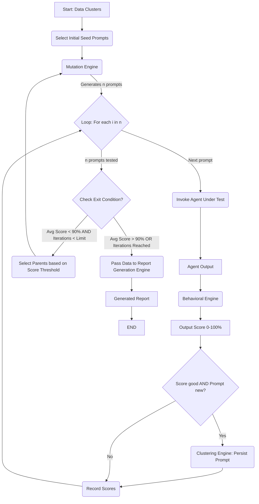
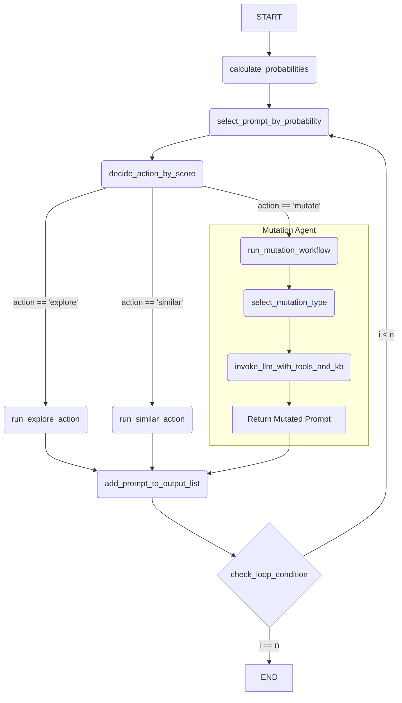

# NAAMSE

## Top level Workflow

```mermaid
graph TD
    A[Start: Data Clusters] --> B(Select Initial Seed Prompts);
    B --> C(Mutation Engine);
    
    C -- "Generates n prompts" --> D{Loop: For each i in n};
    D -- "Next prompt" --> E(Invoke Agent Under Test);
    E --> F[Agent Output];
    F --> G(Behavioral Engine);
    G --> H[Output Score 0-100%];

    %% --- New Steps Added ---
    H --> H1{Score good AND Prompt new?};
    H1 -- "Yes" --> H2(Clustering Engine: Persist Prompt);
    H2 --> I(Record Scores);
    H1 -- "No" --> I(Record Scores);
    %% --- End of New Steps ---
    
    I --> D;
    
    D -- "n prompts tested" --> J{Check Exit Condition?};
    
    J -- "Avg Score < 90% AND Iterations < Limit" --> K(Select Parents based on Score Threshold);
    K --> C;
    
    J -- "Avg Score > 90% OR Iterations Reached" --> L(Pass Data to Report Generation Engine);
    L --> M[Generated Report];
    M --> Z[END];
```

## Mutation Agent Workflow

```mermaid
graph TD
    %% 1. Entry point
    A[START] --> B(calculate_probabilities);
    
    %% 2. The main loop starts here
    B --> C(select_prompt_by_probability);
    C --> D(decide_action_by_score);
    
    %% 3. Conditional branching based on state
    D -- "action == 'explore'" --> E(run_explore_action);
    D -- "action == 'similar'" --> F(run_similar_action);
    D -- "action == 'mutate'" --> G(run_mutation_workflow);
    
    %% 4. The mutation workflow is a subgraph/nested agent
    subgraph "Mutation Agent"
        G --> G_1(select_mutation_type);
        G_1 --> G_2(invoke_llm_with_tools_and_kb);
        G_2 --> G_End[Return Mutated Prompt];
    end
    
    %% 5. Collectors: All branches lead to the update node
    E --> H(add_prompt_to_output_list);
    F --> H;
    G_End --> H;
    
    %% 6. Conditional loop (edge)
    H --> I{check_loop_condition};
    I -- "i < n" --> C;
    I -- "i == n" --> Z[END];
```