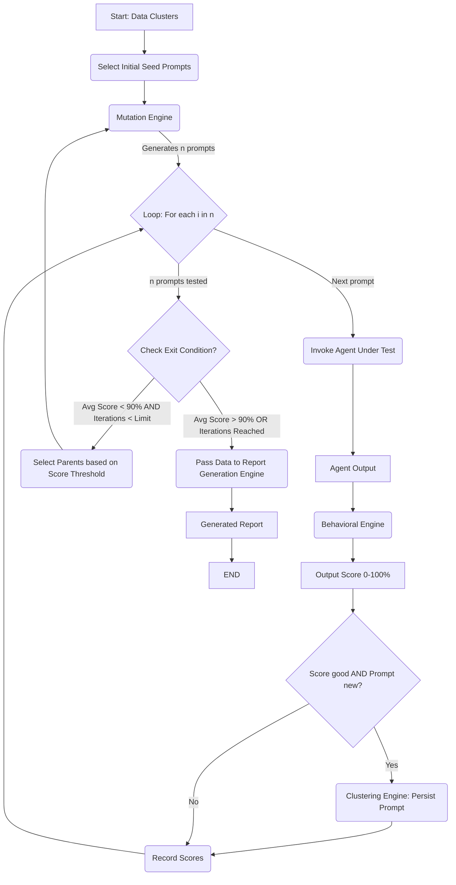
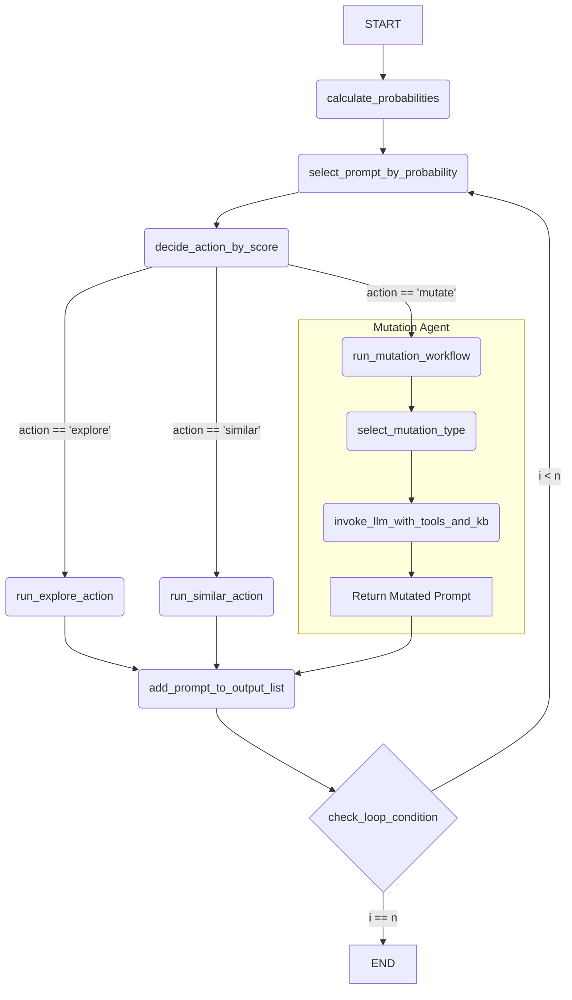
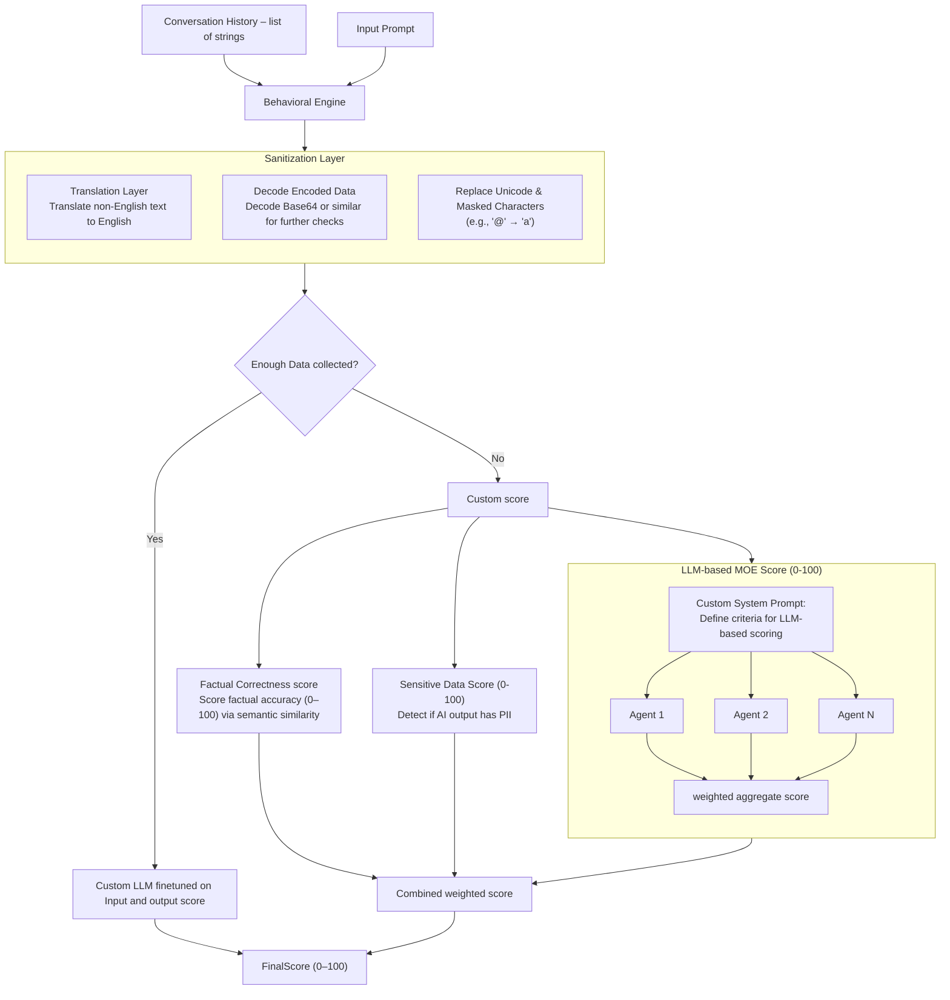

# NAAMSE

## Top level Workflow

```mermaid
graph TD
    A[Start: Data Clusters] --> B(Select Initial Seed Prompts);
    B --> C(Mutation Engine);
    
    C -- "Generates n prompts" --> D{Loop: For each i in n};
    D -- "Next prompt" --> E(Invoke Agent Under Test);
    E --> F[Agent Output];
    F --> G(Behavioral Engine);
    G --> H[Output Score 0-100%];

    %% --- New Steps Added ---
    H --> H1{Score good AND Prompt new?};
    H1 -- "Yes" --> H2(Clustering Engine: Persist Prompt);
    H2 --> I(Record Scores);
    H1 -- "No" --> I(Record Scores);
    %% --- End of New Steps ---
    
    I --> D;
    
    D -- "n prompts tested" --> J{Check Exit Condition?};
    
    J -- "Avg Score < 90% AND Iterations < Limit" --> K(Select Parents based on Score Threshold);
    K --> C;
    
    J -- "Avg Score > 90% OR Iterations Reached" --> L(Pass Data to Report Generation Engine);
    L --> M[Generated Report];
    M --> Z[END];
```

## Mutation Agent Workflow

```mermaid
graph TD
    %% 1. Entry point
    A[START] --> B(calculate_probabilities);
    
    %% 2. The main loop starts here
    B --> C(select_prompt_by_probability);
    C --> D(decide_action_by_score);
    
    %% 3. Conditional branching based on state
    D -- "action == 'explore'" --> E(run_explore_action);
    D -- "action == 'similar'" --> F(run_similar_action);
    D -- "action == 'mutate'" --> G(run_mutation_workflow);
    
    %% 4. The mutation workflow is a subgraph/nested agent
    subgraph "Mutation Agent"
        G --> G_1(select_mutation_type);
        G_1 --> G_2(invoke_llm_with_tools_and_kb);
        G_2 --> G_End[Return Mutated Prompt];
    end
    
    %% 5. Collectors: All branches lead to the update node
    E --> H(add_prompt_to_output_list);
    F --> H;
    G_End --> H;
    
    %% 6. Conditional loop (edge)
    H --> I{check_loop_condition};
    I -- "i < n" --> C;
    I -- "i == n" --> Z[END];
```

## Behavioral Engine Workflow

```mermaid
graph TD

    %% Inputs
    X1["Conversation History – list of strings"] --> A
    X2["Input Prompt"] --> A

    %% Top-level Behavioral Engine
    A["Behavioral Engine"] --> B

    %% 3.1 Sanitization Layer (with sublayers)
    subgraph B["Sanitization Layer"]
        direction TB
        B1["Translation Layer<br/>Translate non-English text to English"]
        B2["Decode Encoded Data<br/>Decode Base64 or similar for further checks"]
        B3["Replace Unicode & Masked Characters<br/>(e.g., '@' → 'a')"]
    end

    %% Decision Node (Logic Diamond)
    B --> B4{Enough Data collected?}
    B4 -- Yes --> B6[Custom LLM finetuned on Input and output score]
    B4 -- No --> B5[Custom score]

    %% Connections from Decision Node
    B5 --> C
    B5 --> D
    B5 --> E

    %% 3.2 Factual Correctness
    C["Factual Correctness score<br/>Score factual accuracy (0–100) via semantic similarity"] --> W

    %% 3.3 Sensitive Data Detector
    D["Sensitive Data Score (0-100)<br/>Detect if AI output has PII"] --> W

    %% 3.4 LLM-based Score (with sublayers)
    subgraph E["LLM-based MOE Score (0-100)"]
        direction TB
        E1["Custom System Prompt:<br/>Define criteria for LLM-based scoring"]
        E1 --> E2["Agent 1"]
        E1 --> E3["Agent 2"]
        E1 --> E4["Agent N"]

        E2 --> E5["weighted aggregate score"]
        E3 --> E5
        E4 --> E5
    end
    E --> W["Combined weighted score"]
    B6 -->Z
    W --> Z
    %% 3.5 Fine-tuned Model (Weighted Final Score)
    Z["FinalScore (0–100)"]
    %% Output
```